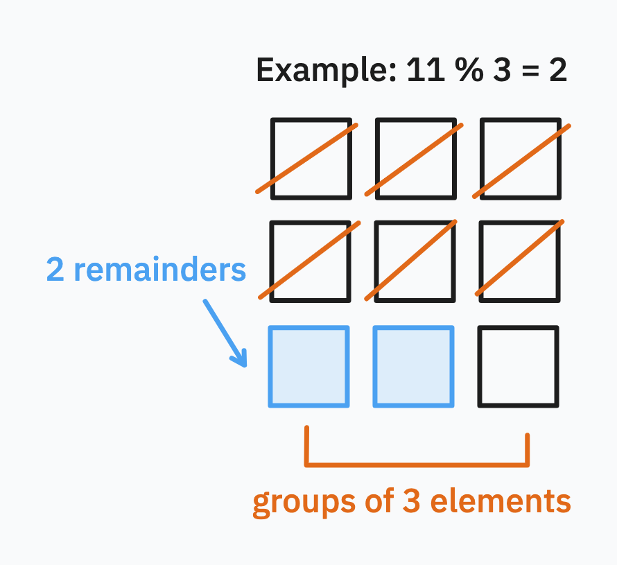

## CS final crib sheet



**Scope:**

A variable declared anywhere outside a function is in the (module’s) global scope, and a variable declared inside a function is in that function’s scope. Blocks like conditionals and loops don't have their own scope.

## Booleans

- `a and b`: only `True` if both `a` and `b` are `True`
- `a or b`: `True` as long as just `a` or just `b` is `True`
- `not a`: returns `True` if `a` is `False` and `False` if `a` is `True`
- Equality operators: `==` (equal) and `!=` (not equal)

## Sequences and collections

### List methods

- `list()` creates new list
- `range(start, stop, step)` creates range
- `alist[idx]` index list
- `alist.append(val)` add item to list
- `alist.extend(anotherlist)` append another list to list
- `alist.index(val)` finds the index of first occurence of item in list
- `alist.insert(val)` inserts `val` into the list before the item at index 
- `alist.pop()` removes last item (and returns it too)
- `alist.reverse()` reverses order
- `alist.sort()` sort list in place (this doesn't return anything!)
- `alist.remove(val)` removes first item found that matches `val`
- `max(alist)` and `min(alist)` do what you'd think they do (return largest/smallest element)
- `alist + blist` concatenates two list
- `alist * n` a new list that returns `alist` n times
- `val in alist` checks if value is in list
- `len(alist)` number of items in list
- `sum(alist)` sum of items in list (if it contains numbers)
booleans on lists depend on the _first item that differs_

### String methods

- `astr.join(iter)` a new string by joining an iterable (e.g. list) of strings with `astr` between each item
- `astr.split(sep)` splits by whitespace (default) or by provided separator `sep`
- `astr.replace(a, b)` replace `a` with `b` in string
- `astr.startswith()`, `astr.endswith()`, `astr.title()`, `astr.upper()`, `astr.lower()` do as you'd expect
- `astr.isalpha()` is alphabetical, `astr.isdecimal()`, `astr.isnumeric()` and `astr.isdigit()` do as you'd expect
- `astr.find()` results in finding the index of the first occurence of a substring; -1 if the substring is not found
- `astr.strip()` this one works like this:
    - `x = "   Hellooo World!    "`
    - Output: `Hellooo World` - note how all the whitespace characters on the left and right are removed
    - When passed argument, it removes characters if they are present at the _start_ and _end_ of the string
    - Stripping on only the left or right of a string is also possible with `x.lstrip()` and `x.rstrip()`

Tuples have much of the same functionality with lists, with two exceptions:
1. They are immutable, any operation that acts on a tuple can only return a new tuple instead of modifying an existing one
2. While they support read indexing, like `atuple[idx]`, they do not support write indexing
3. `min()` and `max()` still work as do `val in atuple` but what doesn't work is `sort()`

## Conditionals and loops

- Use `for item in ls` for iterating over elements
- Use `for i in range(len(ls))` for iterating between 0 and `len - 1` (can use custom step)

## File operations

File objects are created by `open()`. File objects store the current pointer to the line being read. `f.readline()` reads one line forward in the file and advances the pointer. `f.read()` reads the entire remainder of a file to memory. At the end of a file, both return empty strings. `f.close()` closes the file stream.

Static web pages can be opened using the `urllib.request` page and the `request.urlopen()` function - this returns a file object.

## Sets & dictionaries

- `set <= other` tests that `set` is a subset of `other`
- `set < other` tests that `set` is a subset of `other` but `set != other`
- `set >= other` tests that `set` is a superset of `other`
- `set > other` tests that `set` is a superset of `other` but `set != other`
- `set | other` or `set.union(other)` combines all elements of `set` and `other`
- `set & other` or `set.intersection(other)` finds all elements both in `set` and `other`
- `set - other` or `set.difference(other)` finds elements in `set` that are not in `other`
- `set ^ other` or `set.symmetric_difference(other)` finds elements in `set` or `other` but not both
- `set.add(val)` and `set.remove(val)` do as you'd expect

## Quick snippets

Keys list and values list into dictionary:

```python
dict(zip(keys_list, vals_list))
```

Invert dictionary:

```python
inv_map = {v: k for k, v in my_map.items()}
```

Loop through dictionary:

```
for k, v in my_map.items():
    print(k, v)
```

Dictionary comprehension:

```
# squares of evens from 0 to 4
squares = { x: x ** 2 for x in range(5) if x % 2 == 0 }
```

Merge dictionaries: `dict1.copy().update(dict2)`

**Dunder methods**

- Constructor: `__init__`
- Add: `__add__`
- Multiply: `__mul__`
- Divide: `__div__`
- Power: `__pow__`
- Convert to string: `__str__`
- Equal to operation: `__eq__`
- Not equal to operation: `__ne__`
- Less than operation: `__lt__`
- Greater than operation: `__gt__`
- Less or equal operation: `__le__`
- Greater or equal operation: `__ge__`
